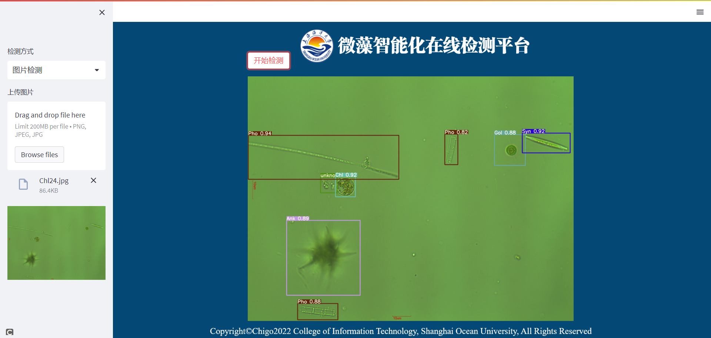
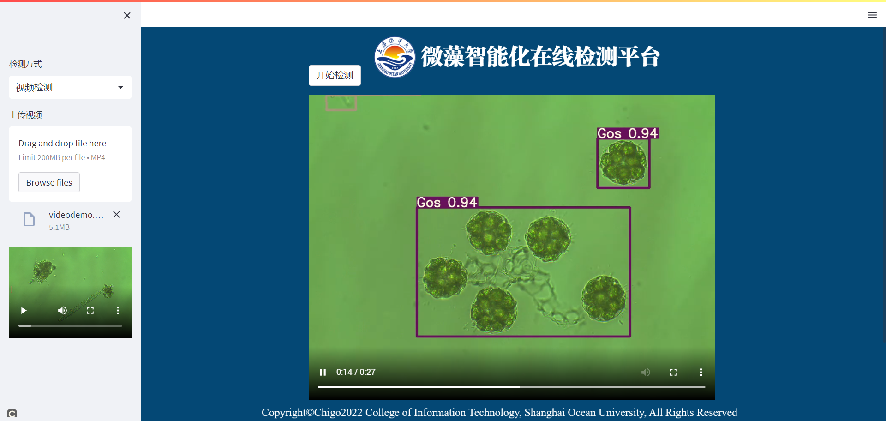

# microalgae-yolov-streamlit

Deploy [YOLO](https://github.com/ultralytics/yolov5/releases/tag/v5.0) detection with [Streamlit](https://github.com/streamlit/streamlit)

博文地址： <https://xugaoxiang.com/2021/08/27/yolov5-streamlit/>

# 线上体验

直接访问 <https://share.streamlit.io/qifengle523/microalgae-yolov-streamlit/main.py>

# 安装依赖

```
# 本地安装的话，请将opencv-python-headless改为opencv-python
pip install -r requirements.txt
```

如果有`GPU`的话，将`torch`替换成`gpu`版本可加速检测

# 运行项目

```
streamlit run main.py
```

**图片检测**



**视频检测**

