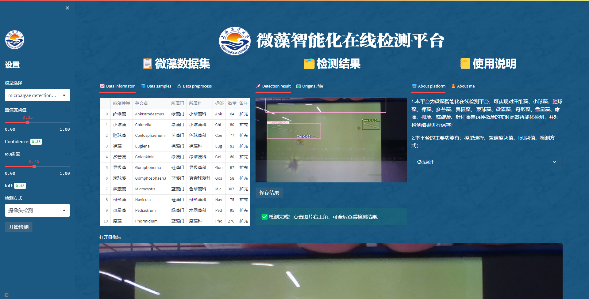

# Microalgae Detection Based on Yolo-Streamlit

## 在线体验

直接访问 <https://share.streamlit.io/qifengle523/microalgae-yolov-streamlit/main/main.py>

__2022.12.12更新__

## 更新内容

1.新增批量检测功能，支持图片和视频批量上传检测；\
2.优化界面UI设计。

## 检测界面
**图片检测**


**视频检测**


**摄像头检测**


------------
__2022.12.11更新__

## 更新内容

1.新增模型选择、置信度阈值、IoU阈值自主设置功能；\
2.新增摄像头检测功能；\
3.新增检测结果保存功能；\
4.新增微藻数据集和使用说明两个板块，检测结果板块支持查看检测结果图和原图；\
5.重新设计界面UI。

## 检测界面
**图片检测**


**视频检测**


**摄像头检测**



------------
__2022.12.09__

## 环境配置

```
pip install -r requirements.txt
```

如果有`GPU`的话，将`torch`替换成`gpu`版本可加速检测

## 启动项目

```
streamlit run main.py
```
## 检测界面
**图片检测**


**视频检测**


## 在线体验

直接访问 <https://share.streamlit.io/qifengle523/microalgae-yolov-streamlit/main/main.py>

## References
[1] <https://docs.streamlit.io/>\
[2] <https://github.com/xugaoxiang/yolov5-streamlit>\
[3] <https://xugaoxiang.com/2021/08/27/yolov5-streamlit/>